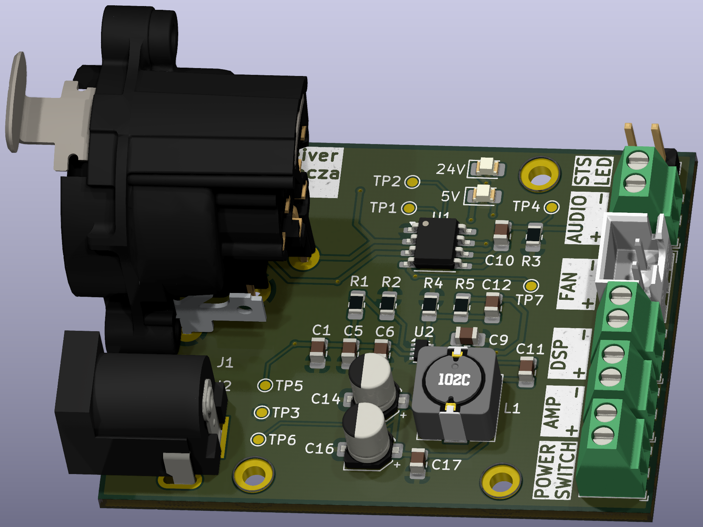

# Balanced Audio Receiver

The **Balanced Audio Receiver** is a versatile, compact PCB (Printed Circuit Board) designed for DIY audio enthusiasts, particularly for use as an input stage in custom speaker projects. The design integrates a balanced XLR 3-pin input and includes an onboard 5V buck converter to provide power for additional components, making it a comprehensive solution for audio applications that require both signal processing and power management.

This board is ideal for anyone looking to build high-quality audio systems, such as home audio setups or custom speaker projects, with a focus on clean, balanced audio signal processing.

> [!NOTE]  
> The latest production files for the Balanced Audio Receiver can be downloaded from the [latest release](https://github.com/brbcza/balanced-receiver/releases/latest).  
> The [Interactive BOM](TBD) is also available in the latest release for easier component sourcing.

## Key Futures

The Balanced Audio Receiver board incorporates several essential features to ensure high performance and flexibility:

* Fully balanced XLR input
* Diferencial THAT1240 amplifier to process incoming audio signal
* Integrated 5V buck converter to power onboard ICs and additional external electronics
* Integraded charge pump to generate -5V to power signal amplifier
* Optional 5V output to power external FAN

## Board Design and Component Sourcing

The Balanced Audio Receiver PCB is designed to be as modular and flexible as possible. It is intended for use in various custom audio systems where space, signal integrity, and power efficiency are important considerations. The generated [Bill of Materials](https://github.com/brbcza/balanced-receiver/releases/latest) from latest release will help to guide you in sourcing the components for assembly.

> **Interactive BOM**  
> The interactive BOM can be found at the following link: [Interactive BOM](TBD).

## Contributing

I welcome any contributions to the project. If you have suggestions for improvements, bug fixes, or want to add new features, feel free to submit pull requests or open issues.

## License

The Balanced Audio Receiver is open-source hardware, licensed under the [GPLv3 License](LICENSE). Feel free to modify and adapt the design for your own use, but please attribute the original project if you distribute it.
